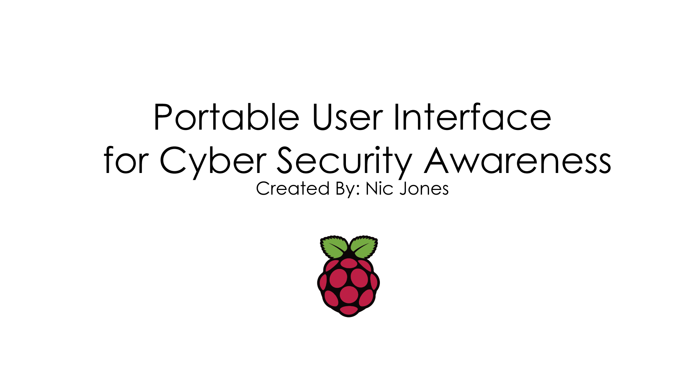

# Sussex Technical High School (STHS) - Sussex Tech Senior Project (STSP)

I developed a "Portable User Interface for Cyber Security Awareness" as my senior capstone project at Sussex Technical High School (STHS). The completion of a final project was essential to graduate from the *Electronics and Computer Engineering* technical area.

View the [final project slides](Portable User Interface For Cyber Security Awareness.pptx) to get the best understanding of the entire project.

